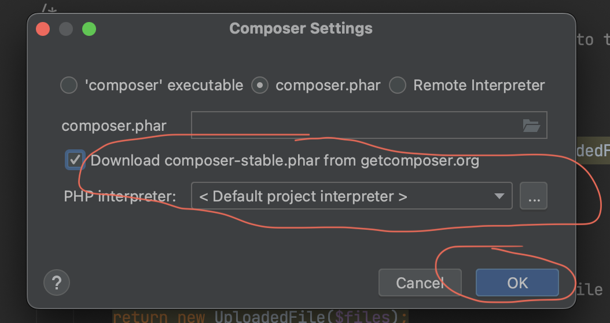
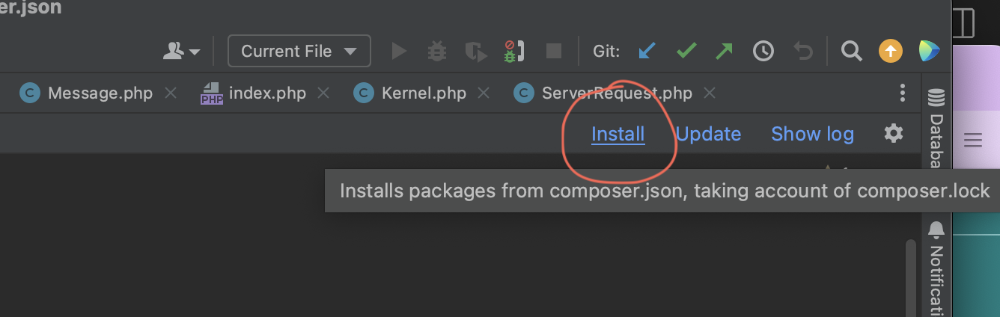
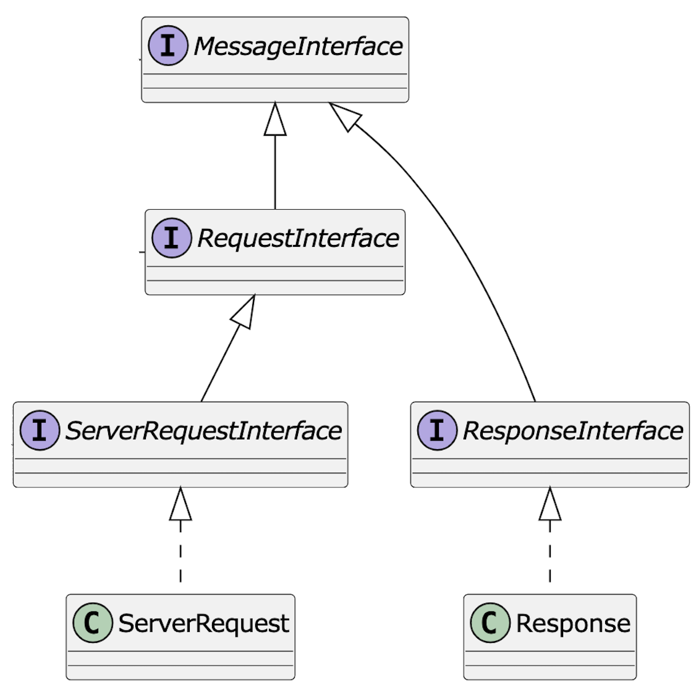
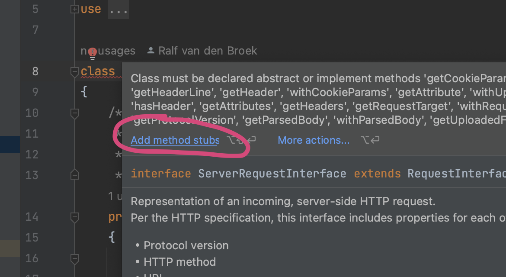
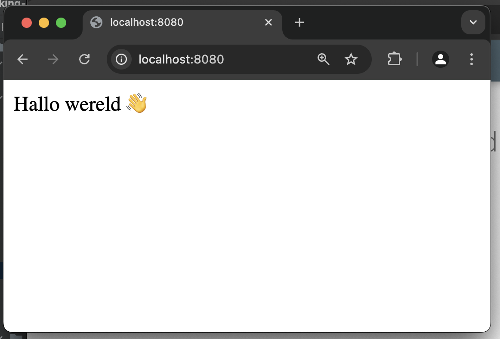

# iteratie 1: een volledige round-trip


## Beschrijving van de inhoud

Tijdens het werkcollege pas je de ingebouwde functionaliteiten die PHP heeft om web requests te verwerken toe, met name de zogeheten superglobals. Daarnaast ga je aan de slag met het framework Symfony; dit framework zal gedurende het vak gebruikt worden als concreet voorbeeld van de behandelde patterns. In dit werkcollege pas je de component HttpFoundation toe, die de request- en responsestructuur van Symfony omvat.

Je begint met de ontwikkeling van de eigen webapplicatie voor de eindopdracht door een eigen request handling component te ontwikkelen aan de hand van de patterns die in de colleges aan bod gekomen zijn. 

## stap 1: installeer de afhankelijkheden

Nadat je de repository hebt gecloned, moet je de afhankelijkheden (dependencies) nog downloaden. De dependency-manager van php is [composer](https://getcomposer.org/). Zie ook [de betreffende kennisclip hierover](https://video.hanze.nl/edit/0_d3k1p1hb).  Composer maakt gebruik van het bestand `package.json` om te checken welke afhankelijkheden er allemaal in het project zitten. Als je op dit bestand klikt, verschijnt er een dialoogvenster waarmee je direct composer kunt downloaden. Als dit gedaan is, kun je vervolgens de dependencies installeren: die komen in de directory `vendor` terecht.





## stap 2: bestudeer en implementeer de `Message`-gerelateerde interfaces.

Bestudeer de interfaces die gedefinieerd zijn in `vendor/Psr/http-message/src`. Deze week gaat het met name om de interfaces waarvan hieronder het diagram is weergegeven. 



Wat is het fundamentele werk dat een web-framework moet doen? Het omzetten van een `ServerRequest` in een `Response`. Niet toevalligerwijs zie je deze twee klassen in het schema onderaan weergegeven. De klasse `ServerRequest` implementeert de interface `ServerRequestInterface` en de klasse `Response` implementeert de interface `ResponseInterface`. 

 Zoals je ziet overeft `ServerRequest` van `Request` en overerft zowel `Request` als `Response` van `Message`. Allereerst zul je dus deze hele hiërarchie van interfaces in implementerende klassen moeten weerspiegelen: doe dit in de directory `Http`. Als je in een klasse de betreffende interface implementeert, kun je met phpstorm automatisch stubs voor de betreffende methoden genereren.

!!! Tip 
    Het is handigste wanneer je met het implementeren van de interfaces begint met de bovenste klassen, `Message` dus in dit geval. Op die manier voorkom je dat phpstorm stubs genereert van de hele hiërarchie van interfaces.



!!! Info "`ServerRequest` en `Request`"
    Meestal spreken we over het omzetten van een `Request` in een `Response`; waar komt dan ineens die `ServerRequest` vandaan?

    Als je de docs leest, staat er bij `Request` dat dit een representatie is van een *outgoing, client side request*, terwijl er bij `ServerRequest` staat dat dit een representatie is van een *incoming, server side HTTP request*. Het punt is dat webframeworks dikwijls zelf ook een request moeten maken, bijvoorbeeld naar een andere service of API. Hier is de `Request` voor nodig. Het `ServerRequest` is datgene dat het framework ontvangt, terwijl het `Request` datgene is dat de server (intern) verstuurt.

## Stap 3: De Kernel

Nu hebben we al bijna de hele infrastructuur die nodig is om een eerste *round trip* te kunnen uitvoeren. Het enige dat we nog nodig hebben is de *Kernel*.

In een web-framework is de *Kernel* de *kern* van de applicatie 😎. Het is de centrale klasse die verantwoordelijk is voor het opstarten, configureren, en afhandelen van verzoeken. We gaan dit ding in de komende weken nog uitgebreid tegenkomen, maar voor nu hoeft -ie niet zo gek veel te doen.

Maak een klasse `Kernel` die de `KernelInterface` implementeert (die staat in `vendor/hanze/itvb21web2-interfaces/src/Kernel`). Zoals je ziet overerft dit ding van `RequestHandlerInterface` die maar één methode heeft: `handle(ServerRequest):Response`. Dít is dus de methode die uiteindelijk een request omzet in een response.

Maak in de `handle`-methode van `Kernel` een nieuwe `Response` aan met gewoon een hard gecodeerde tekst als inhoud. Retourneer dit nieuwe object.

## Stap 4: de klasse `Request` en `Response`

De methode `handle` moet een `ResponseInterface` teruggeven. Gelukkig hebben we hierboven een klasse `Response` gemaakt dit deze interface implementeert. Dit ding is een subklasse van `Message`, die in de constructor onder andere een string mee kan krijgen. Maak in `Response` een constructor die een string ontvangt en geef deze string door aan de superklasse. 

De constructor van `Message` vereist nog twee andere parameters: `protocol_version` en `headers`. Voor nu is het prima als je gewoon `"1.1"` en een lege array in stopt.

!!! Tip
    Een constructor in een php-klasse heeft de signature `public function __construct(...)`. Om de constructor van de superklasse aan te roepen, gebruik je `parent::__construct(...)`.

De klasse `Request` is ook een subklasse van `Message`. Voorzie `Request` van een constructor waarmee je standaardwaarden voor de vereiste parameters aan de superklasse meegeeft (`parent::construct("1/1", []., "")`). In [de volgende iteratie](iteratie2.md) zullen we dit verbeteren.

Implementeer tenslotte de methode `getBody()` in de klasse `Message`. Deze methode moet eenvoudig de `body` teruggeven die bij het aanmaken van een `Message` wordt meegegeven. Bestudeer de constructor van deze klasse om te zien hoe dit werkt.

## De frontcontroller

In web-frameworks zoals deze is de *frontcontroller* het script dat het request in eerste instantie opvangt. In ons geval is dat het script `public/index.php`. Dit bestand bestaat nu nog uit maar één regel: `echo 'Hello world!;`. Het is de bedoeling dat we deze regel vervangen door het opzetten van de objecten-graaf op basis van de infrastructuur die we hierboven hebben gemaakt.

```php
$app = new Kernel();
$request = new ServerRequest();
$response = $app->handle($request);
echo $response->getBody();
```

Nu kun je een server opstarten om de boel te testen. Ga naar de *root* van je project en start een php-ontwikkelserver op:

```shell
php -S localhost:8000 -t public
```

Als je nu met een browser naar `localhost:8000` gaat, zul je (als het goed is) de tekst te zien krijgen die je in de `handle`-methode van de Kernel hebt gebruikt om een `Response`-object aan te maken.

