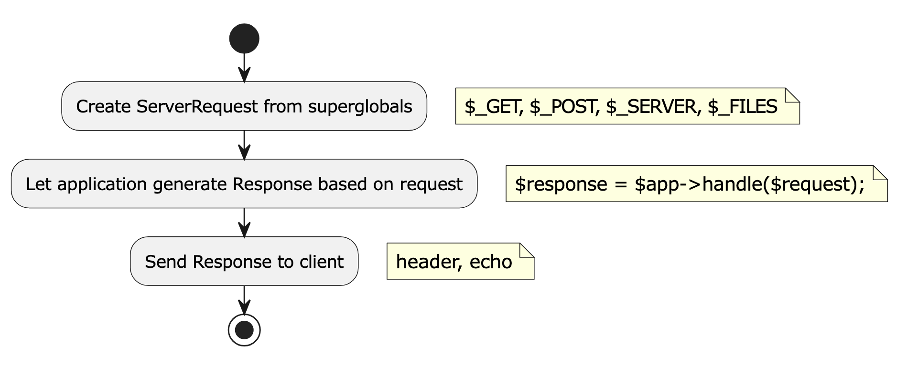
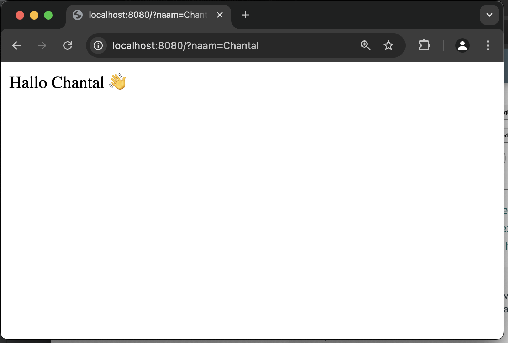

# Iteratie 2: Uitbreiden van `ServerRequest` en `Response`

In de eerste iteratie hebben we gewoon een hard-gecodeerde string teruggegeven en maakten we helemaal geen gebruik van de mogelijkheden die het http ons biedt. In deze tweede iteratie gaan we dat aanpassen.

## Stap 1: superglobals en de `ServerRequest`-klasse

Bekijk [de kennisclip over superglobals](https://video.hanze.nl/media/Kennisclip+web+2%3A+5.superglobals/0_nnouqhx9). Zoals hierin uitgelegd worden alle http-gerelateerde gegevens (en nog wel wat meer) opgeslagen in zogenaamde *superglobals*: globale variabelen die altijd overal beschikbaar zijn – zelfs zonder ze aan het begin van een methode te declareren.

<iframe id="kaltura_player" src='https://api.eu.kaltura.com/p/337/embedPlaykitJs/uiconf_id/23454676?iframeembed=true&amp;entry_id=0_nnouqhx9&amp;config%5Bprovider%5D=%7B%22widgetId%22%3A%220_xxrk8mee%22%7D&amp;config%5Bplayback%5D=%7B%22startTime%22%3A0%7D'  style="width: 400px;height: 285px;border: 0;" allowfullscreen webkitallowfullscreen mozAllowFullScreen allow="autoplay *; fullscreen *; encrypted-media *" sandbox="allow-downloads allow-forms allow-same-origin allow-scripts allow-top-navigation allow-pointer-lock allow-popups allow-modals allow-orientation-lock allow-popups-to-escape-sandbox allow-presentation allow-top-navigation-by-user-activation" title="Kennisclip web 2: 5.superglobals"></iframe>

Op zich is dat heel fijn en makkelijk, maar het maakt onze code wel wat lastiger te testen en wat moeilijker te onderhouden. In principe willen we als software developers nooit gebruik maken van globals, laat staan superglobals. Verder willen we in onze php-applicatie eigenlijk alleen gebruik maken van php-variabelen, niet van relatief vreemde gegevens die schijnbaar zomaar uit de lucht komen vallen en eigenlijk meer in de http- dan bij de php-wereld thuishoren.

Om dit te bewerkstelligen, moeten we ergens een *vertaling* maken van de http- naar de php-wereld. De meest aangewezen plek hiervoor is de klasse die verantwoordelijk is voor het opvangen van het inkomende *request*: de klasse `ServerRequest`.

Deze klasse heeft op dit moment nog geen constructor, maar als je goed naar de methoden uit de interface kijkt, zie je dat dit ding de meeste http-gegevens encapsuleert. We moeten er dus voor zorgen dat instanties van `ServerRequest` beschikking krijgen over deze gegevens. Zoals je in de kennisclip hebt kunnen zien, zijn die min of meer functioneel onderverdeeld. Je hebt `$_GET`, `$_POST`, `$_SERVER` enzovoort. [Klik hier voor het volledige overzicht](https://www.php.net/manual/en/language.variables.superglobals.php).

De algemene flow van onze frontcontroller wordt dan als volgt:



We moeten dus een instantie maken van de `ServerRequest`-klasse waardoor deze de superglobals kan encapsuleren. Maak in deze klasse een statische methode `fromGlobals()` die een `ServerRequest`-object teruggeeft. Zie het onderstaande code-fragment:

```php
class ServerRequest {
    public function __construct(private array $get) {}
    public static function fromGlobals():ServerRequestInterface {
        return new self($_GET);
    }
}
```

!!! Warning
    Die methode `fromGlobals()` is de *enige* plek in ons framework waar we gebruik maken van die superglobals. Overal anders wordt vanaf nu gebruik gemaakt van deze instantie van die `ServerRequest`, die door deze methode teruggegeven wordt.

Zoals aangegeven wordt in php de waarden na het vraagteken in de URL *query parameters* genoemd. Als we bijvoorbeeld een request doen naar `whatever.com/dingen?sleutel1=waarde1&sleutel2=waarde2`, dan wordt de corresponderende `$_GET`:

```php
Array
(
    [sleutel1] => waarde1
    [sleutel2] => waarde2
)
```

Maak van dit gegeven gebruik om de methode `getQueryParams` in `ServerRequest` te implementeren.

## Stap 2: de `handle`-methode in de Kernel

Omdat de `handle`-methode in de Kernel die instantie van de `ServerRequest` mee krijgt, kunnen we hier gebruik maken van de methode `getQueryParams` die je hierboven hebt geïmplementeerd. Maak van deze mogelijkheid gebruik om de waarde van de sleutel `naam` op te halen, zodat iemand een request kan doen naar `localhost:8000:?naam=henk`.

Gebruik de waarde die de bezoeker heeft ingetypt op je vriendelijke welkomstboodschap wat persoonlijker te maken. Hou er wel rekening mee dat de sleutel `naam` niet per se hoeft te bestaan: je moet dus een standaardwaarde hiervoor aangeven.


