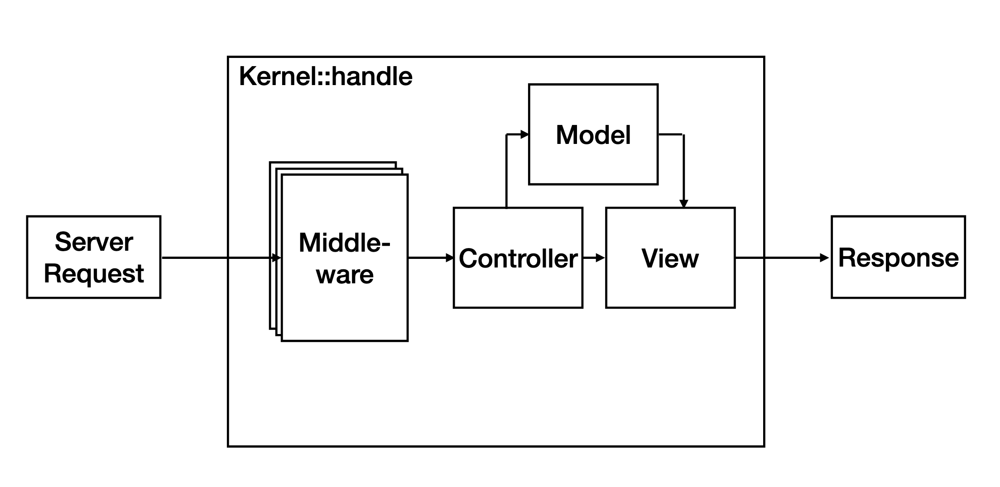
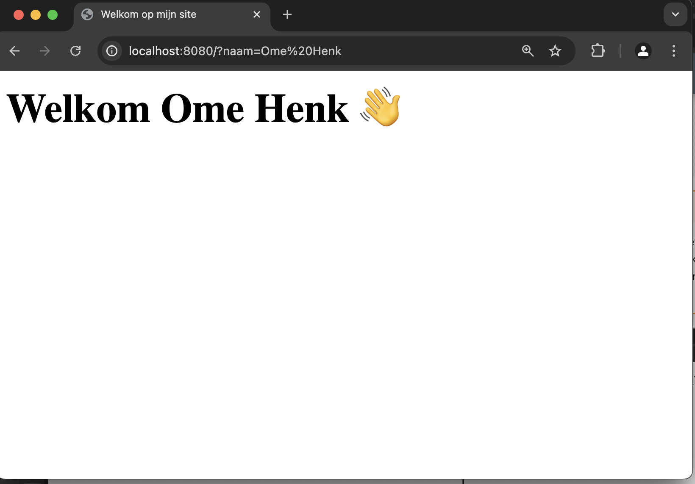

# Iteratie 3: Model View Controller

Nu we in staat zijn om vanuit onze frondcontroller een stuk tekst in de browser te laten zien, is het zaak om deze tekst in een separaat bestand onder te brengen. Het zou immers niet handig zij om in onze *Kernel* alle mogelijke pagina's op te nemen die ons framework kan laten zien: dat zou de klasse erg vervuilen met html, wat de boel onoverzichtelijk en ononderhoudbaar zou maken. 

De html-bestanden die we gaan maken, vormen min of meer de *View* in [het model-view-controller ontwerppatroon](). Feitelijk zijn dit niet per se html-bestanden, maar meer staketsels van html, die we later via de controller gaan vullen met data uit het model. Hierom spreken we niet van html-bestanden, maar van html-*templates*, of kortweg *templates*.



Het is een beetje een discusie waar op je *file system* je deze templates neerzet, maar in deze uitwerking gaan we uit van een directory `tempates` die *naast* de directories `public` en `src` staat:

```shell
app/
├─ composer.json
├─ public/
├─ src/
├─ templates
├─ vendor
```

## Stap 1: het bestand `index.html`

De eerste pagina die we gaan maken is het bestand `index.html`. Maak dit bestand aan in je `templates` directory en zet hier valide html in die de bezoeker vriendelijk verwelkomt. Voor nu is het prima om even de naam, die we na de vorige iteratie konden weergeven, te negeren – die voegen we later wel weer toe.

!!! Info
    De meeste webservers – en de ontwikkelserver van php die we steeds gebruiken – zijn zo geconfigueerd dat als een bezoeker geen specifiek bestand opvraagt via de `GET`-methode (dus een request naar bijvoorbeeld `localhost:8080/directory/`) de server op zoek gaan naar een bestand `index.html` of `index.php`. Hoewel we dit later met de hand gaan uitwerken, is dit dus wel het gedrag dat verwacht wordt.

## Stap 2: aanpassen van de Kernel

Nu we dit bestand hebben gemaakt, is het van belang dat we in de `handle`-methode van onze `Kernel` de inhoud *hiervan* terugsturen in plaats van een hard-gecodeerde string. Maakt gebruik van de php-methode [`file_get_contents()`](https://php.net/file_get_contents) om de inhoud van het zojuist gemaakte html-bestand als één langs string in te lezen, en maak een `Response` aan met deze string als body.

!!! Tip
    Hoewel je nu met het bestand `Kernel` aan het werk bent, moet je voor de juiste paden denken vanuit het bestand `public/index.php`: dit is immers het bestand dat door de server wordt uitgevoerd. In een latere stap gaan we dit nog wel aanpassen en configureerbaar maken.

## Stap 3: Output buffering

Zoals tijdens de demonstratie is toegelicht, hebben bestanden die je in aan een methode hebt toegevoegd dezelfde *scope* als deze methode zelf. Dat houdt in dat je in die bestanden gebruik kunt maken van variabelen die je eerder in die methode hebt gedefinieerd. 

Maak gebruik van dit gegeven om de naam van de persoon (feitelijk de *value* van de query-parameter met de *key* `name`) weer via de template weer te geven. Je kunt dit eenvoudig doen door de in template gebruik te maken van `<?= ... ?>`-constructie die je tijdens het plenaire deel hebt gezien: zo kun je de template eigenlijk zien als een string met een php-script.

Om deze string als script vervolgens uit te voeren, kun je gebruik maken van [de php-functie `eval`](https://php.net/eval). Dit print evenwel direct de inhoud naar de client (de browser), maar willen controle houden over wat er exact gebeurt. Gelukkig heeft php een techniek om de output te bufferen en op een later moment op te halen, aan te passen of alsnog te printen: hiervoor zijn met name de functies [`ob_start()`](https://www.php.net/manual/en/function.ob-start.php), [`ob_get_clean()`](https://www.php.net/manual/en/function.ob-get-clean.php) van belang. Bekijk eventueel [de uitgebreide documentatie op php.net](https://www.php.net/manual/en/book.outcontrol.php). 

Nog één kleine stap: om te voorkomen dat `eval` de html als php probeert uit te voeren, moeten we het geheel voorzien van een 'einde-php-tag': `?>`. Zie het voorbeeld hieronder:

```php
$naam = 'Henk';
ob_start();
$f = '?>' . file_get_contents('index.html');
eval($f);
$res = ob_get_clean();
echo $res;
```

!!! Warning
    De methode `eval` is natuurlijk erg gevaarlijk, omdat dit gewoon de code als php uitvoert. De infrastructuur die we nu hebben opgezet maakt het bijvoorbeeld erg gemakkelijk om allerlei gevaarlijke scripts in ons framework te injecteren. Dat gaan we op een later tijdstip nog wel veranderen.


