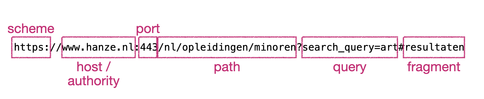
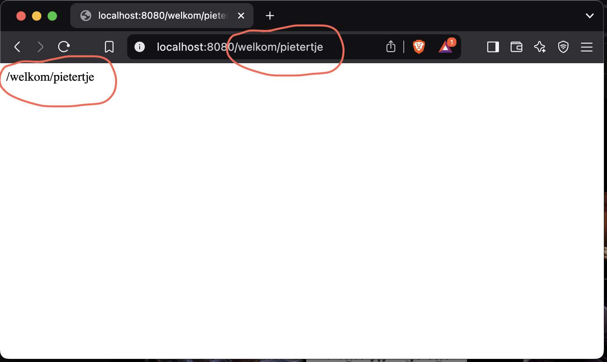
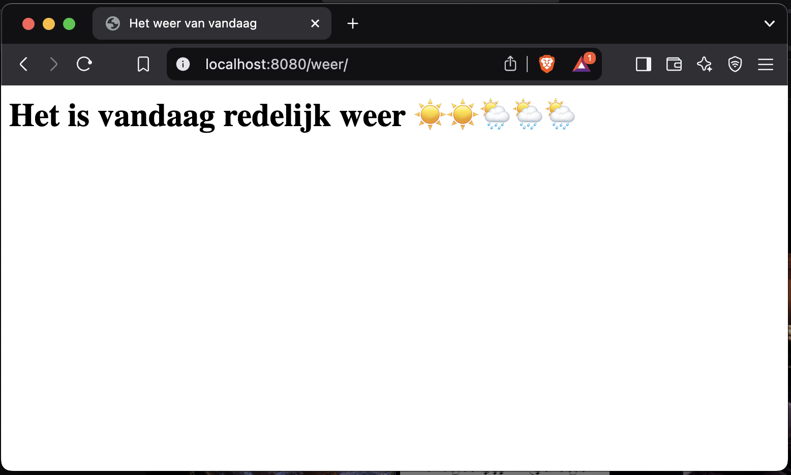

# Iteratie 4: meer paden

## Stap 1: De klasse Uri 

Bij [de laatste refactoring](../week3%20-%20http/refactor.md) hebben we de klasse `Uri` nog genegeerd - we zeiden dat we daar vooralsnog een string in mochten stoppen. Nu is het tijd om dit stuk code op te ruimen.

Maak, opnieuw in de directory `Http`, een klasse `Uri` die (vanzelfsprekend) de interface `UriInterface` implementeert. Laat phpstorm de null-implementaties van de gewenste methode creëren.

Zoals je kunt lezen is dit een uitwerking van [RFC 3986](https://www.rfc-editor.org/rfc/rfc3986). Bestudeer [de presentatie van het theoriecollege](../files/presentatie-http.pdf) om te weten welke onderdelen van een url corresponderen met welke term uit deze RFC.


!!! Info "URI, URL en URN"
    Er zijn feitelijk drie verschillende termen die horen bij een internetadres: URL, URN en URI. Een URI (Uniform Resource Identifier) is een string van karakters waarmee een naam, een adres of een *resource* op het internet geïdentificeerd kan worden. 

    Een URI (*Uniform Resource Identifier*) is een overkoepelende term voor een string die een specifieke resource identificeert, hetzij door lokalisatie, naamgeving, of beide. Binnen deze categorie vallen URL's (Uniform Resource Locators), die niet alleen *identificeren* maar ook de locatie en het toegangsmechanisme (zoals `http://` of `ftp://`) specificeren. Een URN (*Uniform Resource Name*), tenslotte, is een URI die uitsluitend bedoeld is als permanente naam zonder dat deze een specifieke locatie of toegangsmethode hoeft te bevatten, zoals een ISBN voor boeken. Kortom, elke URL en URN is een URI, maar een URI hoeft niet per se een URL of een URN te zijn.

    Bestudeer eventueel ook [de documentatie op w3.org](https://www.w3.org/TR/uri-clarification/).




Bestudeer de interface om te kijken wat er zoal van de klasse gevraagd wordt. Zoals je ziet heeft deze interface een hele zooi methoden. We gaan die in eerste instantie niet allemaal uitwerken: vooralsnog gebruiken we alleen de methoden die we nodig hebben om relatief eenvoudige requests zoals die hierboven is weergegeven te representeren. Zorg ervoor dat deze gegevens via de constructor van `Uri` worden opgeslagen. Implementeer ook de corresponderende `get`- en `with`-methoden.

!!! Tip
    We slaan de gegevens voor nu in `Uri` nog even op als string. Op een later tijdstip zullen we dit nog moeten aanpassen, omdat niet alle karakters zonder meer in een webadres kunnen voorkomen, én omdat we mogelijk nog een eigen protocol gaan ontwerpen.

Maak vervolgens in `ServerRequest` een instantie aan van `Uri`, waarin de gevraagde gegevens via de waarden uit de betreffende encapsulaties van de superglobals worden opgeslagen – let op dat je juiste standaard-waarden aan de betreffende velden meegeeft wanneer deze niet bestaan. Pas het type van de parameter uit `Request` aan dat deze geen strings meer kan bevatten en geef het zojuist gecreëerde `Uri`-object vanuit `ServerRequest` mee.

Feitelijk zijn we hier bezig met een refactorslag, die we wel echt nodig hebben om de volgende stap uit te kunnen worden. Na afloop van deze stap is dus als het goed is geen extra functionaliteit geïntroduceerd.

!!! Info 
    Wanneer we in deze uitleg spreken over de superglobals, bedoelen we natuurlijk de weergave of opslag daarvan in het `ServerRequest`-object.


## Stap 2: een beter pad

De manier waarop we nu onze vriendelijke welkomstpagina te zien krijgen is wat onduidelijk. Je moet maar net weten dat je een request moet doen naar `index.php?naam=<naam>`; sowieso is het wat ongebruikelijk om met dit soort request-parameters te werken. Laten we dit pad vervangen door een request naar `welkom/<naam>` – dat kunnen we nu doen, doordat we alle noodzakelijke gegevens in het `Uri`-object hebben opgeslagen.

Vooralsnog wordt het noodzakelijke werk gedaan in de methode `handle` van de `Kernel`. Deze methode krijgt de `request` mee, waarin de `uri` zit, waarin het veld `path` is opgeslagen. Wanneer we dit gegeven even uitprinten, krijgen we het volgende resultaat:

```php
# in de klasse `Kernel`:    
public function handle(ServerRequestInterface $request): ResponseInterface
    {
        print_r($request->getUri()->getPath());
    }
}
```



Maak gebruik van dit gegeven om te checken of de request gedaan is naar `welkom/<naam>`. Je zult hiervoor dus het pad moeten splitsen op `/`, waarbij het eerste deel gelijk moet zijn aan `welkom` en het tweede deel de *naam* bevat (die is dus variabel). Pas hiervoor de code in `handle` in `Kernel` aan.

## Stap 3: een tweede pad

Nu we deze techniek hebben, kunnen we natuurlijk relatief eenvoudig een tweede pad toevoegen. Hiervoor hoeven we in principe alleen maar het betreffende pad in de `handle`-methode van de `Kernel` op te nemen en de juiste output te genereren.

Maak een tweede html-pagina aan in de `templates`-directory; wat erin staat is voor nu niet zo gek belangrijk – wij gebruiken in dit voorbeeld een pagina die het weer weergeeft. Bedenk een voor de hand liggend pad dat iemand moet intypen om deze pagina te zien te krijgen (in ons voorbeeld is dit een request naar `/weer`). Voeg in de `handle`-methode in de `Kernel` een check toe die kijkt of het invulde pad hiermee correspondeert en geef de betreffende pagina terug.



!!! Success
    We hebben nu de infrastructuur opgezet om eenvoudig verschillende requests door verschillende onderdelen van ons script af te handelen. Voorlopig is het alleen maar het laten zien van verschillende pagina's, maar je kunt deze structuur natuurlijk gebruiken om heel verschillende wegen door de applicatie aan te spreken.


