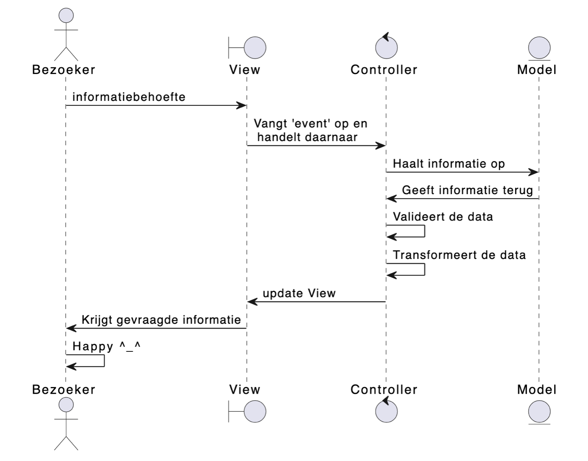
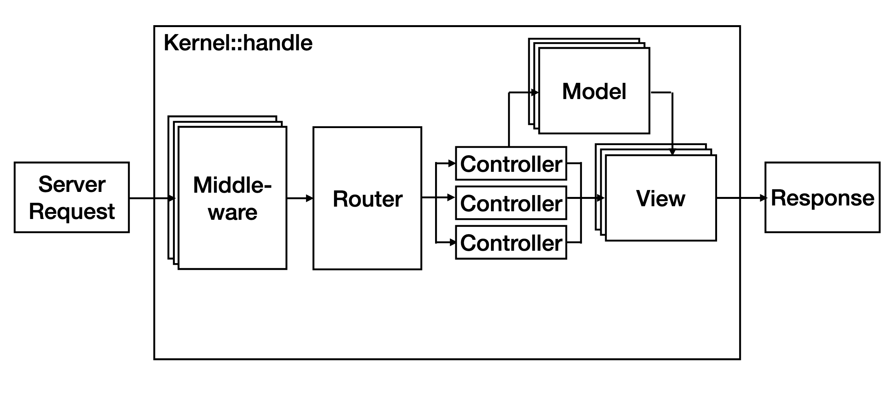
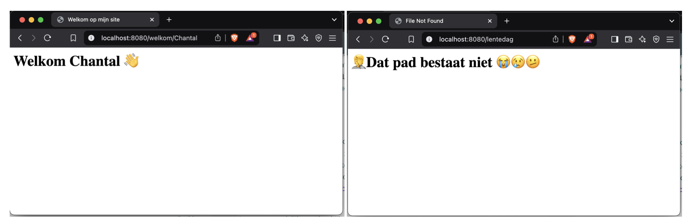

# Iteratie 5: Controllers en Routers

Hoewel de functionaliteit nu op zich prima werkt, kun je je wel voorstellen dat dit niet schaalt. Hoe meer verschillende paden we in onze applicatie willen opvangen, hoe ingewikkelder onze `handle`-methode in de `Kernel` wordt. Dit is een gevolg van het feit dat we alle functionaliteit feitelijk in precies deze methode hebben gestopt. In het kader van [*seperation of concerns*](https://en.wikipedia.org/wiki/Separation_of_concerns) is het veel beter om de verschillende stappen door verschillende klassen uit te laten voeren. Dat is waar de *Controllers* in beeld komen.

Bekijk nog eens de betreffende dia uit het theoriecollege (zie hieronder). Het gaat hier met name om de onderste helft van dit plaatje. De bezoeker heeft een informatiebehoefte en typt hiervoor een url in de navigatiebalk van de webbrowsers, waardoor een request wordt geïnitieerd. Zoals je ziet wordt dit request opgevangen door een controller, die vervolgens de view update die weer naar de client wordt teruggestuurd. Voor nu negeren we even het model.

## Stap 1: de controllers

Controllers zijn feitelijk klassen die - via de Kernel – de requests afhandelen. Hierom moeten alle controllers instanties zijn van de `RequestHandlerInterface`, die je in `vendor/psr/http-server-handler/src/RequestHandlerInterface.php` kunt vinden. 

Bestudeer deze interface. Zoals je ziet heeft deze maar één methode `handle(ServerRequestInterface):ResponseInterface`. Dit lijkt natuurlijk als twee druppels water op de `handle`-methode in onze `Kernel`-klasse, maar controllers zitten nét even ergens anders in de round-trip:

1. `Kernel` wordt aangemaakt.
2. `ServerRequestObject` wordt aangemaakt.
3. De methode `handle` in `Kernel` wordt aangeroepen.
4. In deze methode wordt de juiste `Controller` voor deze `Request` gebruikt.
5. Deze `Controller` geeft de bijhorende `Response` aan de `Kernel` terug.
6. De `Kernel` retourneert deze `Response`.
7. Deze `Response` wordt naar de client gestuurd.

Zo zie je dat de *Kernel* de verantwoordelijkheid van het maken van de juiste `Response` verlegt naar een `Controller`. Omdat alle controllers dezelfde interface implementeren, maakt het voor de Kernel niet uit *wie* de response heeft gemaakt: deze klasse is alleen maar geïnteresseerd in *dat* er een response komt die hij kan terugsturen naar de frontcontroller.

Momenteel hebben we twee pagina's: `welkom` en `weer`. Maak een nieuwe directory `Controllers` met hierin voor beide pagina's een klasse die de `RequestHandlerInterface` implementeert. Noem de klassen `WelkomController` en `WeerController` (je verwacht het niet 😎).

Verplaats de functionaliteit die je tot nu toe in de `handle`-methode van de `Kernel` hebt staan naar de `handle`-methode van de betreffende controller – bedenk zelf een goede techniek om die variabele uit het pad (`<naam>`) in de `WelkomController` te krijgen. Gebruik de check die je in `Kernel` hebt staan om één van beide pagina's te laten zien om een instantie van de juiste controller aan te maken. Roep vervolgens de `handle`-methode op deze controller aan en retourneer de response die je van de controller terugkrijgt.

## Stap 2: de router

Onze applicatie begint nu werkelijk te groeien. We kunnen verschillende paden opvragen en afhankelijk hiervan fijn verschillende pagina's laten zien. Het is alleen nog wel een beetje stom dat we onze *kernel* moeten openen om te zien welke controllers bij welk pad horen - en ook om eventuele nieuwe controllers en nieuwe paden toe te voegen. Dat is wat onhandig, het schaalt niet en past ook niet bij het [Single Responsibility Principle](https://en.wikipedia.org/wiki/Single-responsibility_principle). Het is tijd om de klasse `Router` toe te voegen.

De klasse `Router` is verantwoordelijk voor het hijbouden welke controller bij welk pad (welke *route*) hoort. Bekijk nog een keer de betreffende dia uit het hoorcollege:

Bestudeer de interface `RoutingInterface`, die je kunt vinden in `vendor/hanze/itvb21web2-interfaces/src/Routing/RouterInterface.php`. Maak een klasse `Router` in de namespace `Framework\Routing` die deze interace implementeert. De methode `route` geeft een `RequestHandlerInterface` terug, wat natuurlijk onze *controllers* zijn die we in de stap hierboven hebben gemaakt.

Maak in je frontcontroller een associatieve array met de paden (routes) als *key* en de controllers als *value*. Let op: het volledige pad kan natuurlijk iets zijn als `welkom/<naam>` of `blogpost/<id>`. Begin met het matchen van de letterlijke string (dus bijvoorbeeld `welkom` en `weer`, in ons voorbeeld). Zorg ervoor dat de waarden van deze array de volledige klassenaam van de controller die bij dit pad hoort is. We zullen in [de laatste iteratie van deze week](iteratie6.md) dit nog wat uitbreiden.

Maak vervolgens, eveneens in je frontcontroller, een instantie aan van `Route`, waarbij je deze assiociatieve array meegeeft. Geeft tenslotte deze intantie weer mee aan de `Kernel` die je al eerder hebt gemaakt (je zult dus de constructor van `Kernel` ook moeten aanpassen).

!!! Tip
    Om in php het volledige pad van een klasse te krijgen, kun je gebruik maken van de syntax `KlassseNaam::class`.

Pas tenslotte de methode `handle` in `Kernel` aan, zodat deze gebruik maakt van de instantie van `Route` die je bij het aanmaken hiervan hebt meegegeven. Test je resultaat tot zover door een nieuwe route met bijhorende controller en view (html-pagina) te maken. Maak ook een `FileNotFoundController` met bijhorende pagina en zorg ervoor dat deze controller wordt gebruikt wanneer in de methode `route` in `Router` het opgevraagd pad niet bestaat (dat wil zeggen niet in de associatieve array voorkomt).

