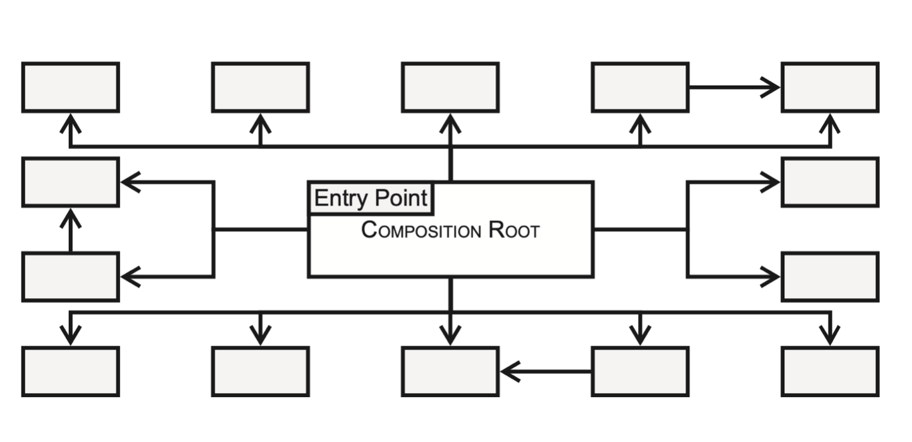

# Iteratie 7: *dependency injection* en *reflection*

## Stap 1: dependency injection

Zoals tijdens het hoorcollege is toegelicht, is het niet handig wanneer objecten instanties aanmaken van andere klassen: dat levert verborgen afhankelijkheden op en maakt de boel moeilijk onderhoudbaar en testbaar. Om een afhankelijkheid van een klasse op een andere klasse te verduidelijken, maken we daarom gebruik van [*dependency injection*](https://en.wikipedia.org/wiki/Dependency_injection). We hebben daar drie vormen van besproken:

- *constructor injection*
- *method injection*
- *property injection*

De eerste van deze drie vormen is verreweg de meest gebruikte: bij het aanmaken van een klasse moet de client-code een instantie van de afhankelijkheden meegeven. In principe gebeurt dat allemaal op één plek: de zogenaamde *composition root*:



In theorie is onze *frontcontroller* de *composition root*: hier worden alle instanties van de klassen gemaakt en de objectengraaf samengesteld. Zo heeft bijvoorbeeld de klasse `Kernel` een instantie van de `Router` nodig, die op zijn beurt weer alle `Route`s nodig heeft.

Verander je code zo, dat je in principe alleen in de frontcontroller nieuwe instanties van klassen aanmaakt. Je zult hiervoor mogelijk verschillende klassen moeten aanpassen, omdat je waarschijnlijk gebruik wilt maken van *constructor injection*: je zult dus de signature van de constructor van verschillende klassen moeten uitbreiden.

!!! Warning
    __let op:__ maak geen instanties aan van de verschillende controllers die je momenteel in je framework hebt zitten. Dat is een beetje overkill omdat je uiteindelijk waarschijnlijk maar één controller nodig hebt, en omdat het aanmaken van die constrollers best ingewikkeld kan zijn. We gaan dat in de volgende stap automatiseren.


## Stap 2: Reflection

Als je kijkt naar de realisatie van de klasse `Route` die je dat deze verantwoordelijk is voor het aanmaken van een instantie van de controller die hoort bij het pad waar deze `Route` bijhoort. Momenteel wordt in deze betreffende methode (`handle` in [het voorbeeld van de vorige iteratie](../week4%20-%20mvc/iteratie6.md#l#stap-2-aanpassingen-in-de-klasse-router)) de constroller aangemaakt met het sleutelwoord `new`. Qua afhankelijkheid en leesbaarheid is dat hier niet zo'n heel groot probleem, omdat die `Route` expliciet verantwoordelijk is voor het koppelen van een pad een een route. Het gaat evenwel mis, wanneer een controller zelf allerlei afhankelijkheden heeft. Zo zijn er controllers die een connectie met de database nodig hebben, of één of andere specifieke service, of bedenk het maar.

Om dit proces te automatiseren maken we gebruik van [de php reflection api](https://www.php.net/manual/en/book.reflection.php). Dankzij deze api kunnen we programmacode in runtime inspecteren en, bijvoorbeeld, kijken welke parameters er allemaal aan de constructor moeten worden meegegeven om instanties van een klasse te maken.

Kijk nog even naar de opdracht die tijdens het werkcollege besproken is. Het ging er hier om een instantie te maken van `Test` *zonder* gebruik te maken van `new`:

```php
class A {}
class B {}
class Test {
    public function __construct(public A $a, public B $b) {}
}
```

Dankzij reflection kunnen we kijken naar de constructor van `Test` en de typen van de parameters opvragen. Vóórdat we een instantie van `Test` maken, maken we dan éérst een instantie aan van `A` en van `B`, en die geven we dan mee aan de constructor van `Test`:

```php
$rc = new ReflectionClass(Test::class);
$args = [];
foreach ($rc->getConstructor()->getParameters() as $param) {
    $paramClass = new ReflectionClass($param->getType()->getName());
    $args[$param->getName()] = $paramClass->newInstance();
}
$test = $testClass->newInstance(...$args);
```

Gebruik deze techniek om in de betreffende methode in de `Route` een concrete instantie van de betreffende controller aan te maken. Roep vervolgens de methode `handle` aan op deze controller en retourneer de `Response` die wordt teruggegeven (zie eventueel nog het sequentiediagram in interatie 6). 

!!! Info
    De typen van de parameters kunnen op hun beurt natuurlijk ook weer afhankelijkheden in hun constructor gedefinieerd hebben. Je zult dus op de één of andere manier recursie in je uitwerking moeten inbouwen.

